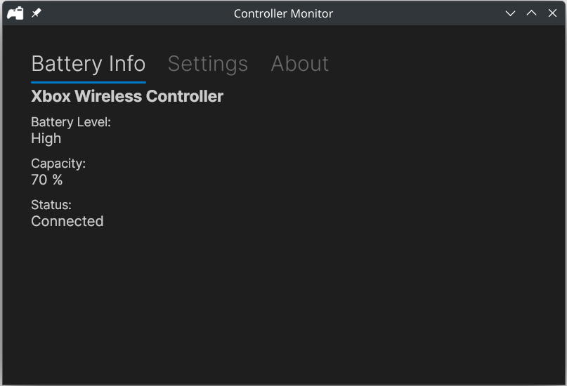
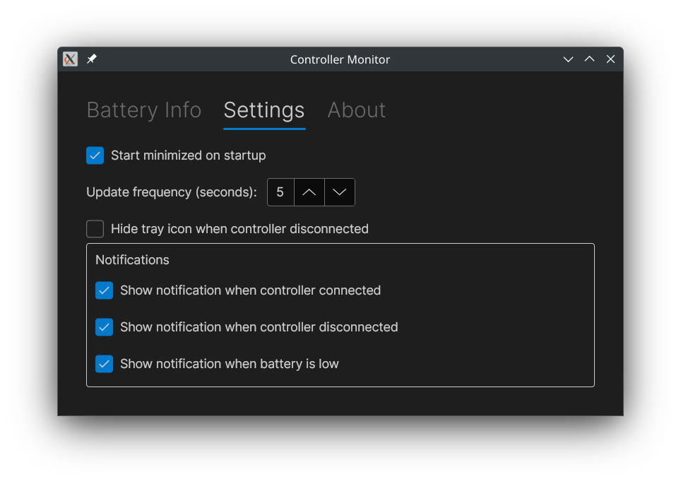

# Controller Monitor

[](https://opensource.org/licenses/MIT)

A cross-platform Avalonia UI application for monitoring game controller battery levels.

## Features

### Core Functionality
- **Cross-platform support** - Linux and Windows implementations
- **Real-time battery monitoring** - Continuous polling of controller battery levels
- **Charging status indication** - Shows when controllers are charging
- **System tray integration** - Minimizes to tray for background monitoring
- **Single instance management** - Prevents multiple instances from running

### User Interface
- **Clean, modern GUI** - Built with Avalonia UI and Fluent theme
- **Battery level visualization** - Icons and percentage indicators
- **Connection status tracking** - Shows connected/disconnected state
- **Theme support** - Light, dark, and auto themes

### Settings & Configuration
- **Start minimized** - Launch directly to system tray
- **Update frequency** - Configurable polling interval (default: 5 seconds)
- **Tray icon visibility** - Option to hide tray icon when no controllers connected
- **Notification preferences** - Control when to show notifications
- **Window positioning** - Remembers window size and position

### Notifications
- **Controller connection alerts** - Notify when controllers connect/disconnect
- **Low battery warnings** - Alert when battery levels are critical
- **System integration** - Uses native notification systems (libnotify on Linux)

## Logging

The application uses Serilog for structured logging with console output. You can control the log level using the `--log-level` command-line parameter:

```bash
# Run with verbose logging
./ControllerMonitor --log-level=verbose

# Run with debug logging
./ControllerMonitor --log-level=debug

# Run with warning level and above (default: information)
./ControllerMonitor --log-level=warning
```

Available log levels: `verbose`, `debug`, `information`, `warning`, `error`, `fatal`

## Screenshots

### Main Application Window - Status View


### Main Application Window - Settings View


### System Tray Integration


The application provides a clean, intuitive interface for monitoring your game controllers' battery levels. The main window shows real-time battery information, while the system tray integration allows for quick status checks without opening the full application.

## Installation

### Pre-built Packages

Download the latest release from [GitHub Releases](https://github.com/SilentLeader/controller-battery-monitor/releases).

#### Debian/Ubuntu (.deb)
```bash
sudo dpkg -i ControllerMonitor-Linux-*.deb
sudo apt-get install -f  # Install any missing dependencies
```

#### Arch Linux (.pkg.tar.zst)
```bash
sudo pacman -U ControllerMonitor-Linux-*.pkg.tar.zst
```

#### Manual Installation (tar.gz)
```bash
tar -xzf ControllerMonitor-Linux-*.tar.gz
cd ControllerMonitor-Linux-*
# Copy files to appropriate locations or run directly
```

#### Optional Dependencies

For system notifications support, install `libnotify` (provides `notify-send`):

**Debian/Ubuntu:**

```bash
sudo apt-get install libnotify-bin
```

**Arch Linux:**

```bash
sudo pacman -S libnotify
```

**Fedora/RHEL:**

```bash
sudo dnf install libnotify
```

**OpenSUSE:**

```bash
sudo zypper install libnotify-tools
```

For enhanced battery monitoring on Linux, install `upower`:

**Debian/Ubuntu:**

```bash
sudo apt-get install upower
```

**Arch Linux:**

```bash
sudo pacman -S upower
```

**Fedora/RHEL:**

```bash
sudo dnf install upower
```

**OpenSUSE:**

```bash
sudo zypper install upower
```

After installation, you can:

- Launch from your desktop environment's application menu
- Run `controller-monitor` from the command line
- The application will appear in your system tray (if supported)
- Receive system notifications when libnotify is available

### From Source

#### Prerequisites

- **.NET 9.0 SDK** - Required for building the application
- **Linux dependencies** (Linux only):
  - `libupower-glib` for UPower integration
  - `libnotify` for system notifications (optional)

#### Building and Running

1. **Clone the repository:**
   ```bash
   git clone https://github.com/SilentLeader/controller-battery-monitor.git
   cd controller-battery-monitor
   ```

2. **Navigate to the project directory:**
   ```bash
   cd src/ControllerMonitor
   ```

3. **Restore packages:**
   ```bash
   dotnet restore
   ```

4. **Build the project:**
   ```bash
   dotnet build
   ```

5. **Run the application:**
   ```bash
   dotnet run
   ```

#### Platform-Specific Builds

**Linux (with AOT compilation):**
```bash
# Build for Linux x64 with AOT
dotnet publish -c Release -r linux-x64 --self-contained true -p:PublishAot=true

# Build for Linux ARM64
dotnet publish -c Release -r linux-arm64 --self-contained true -p:PublishAot=true
```

**Windows:**
```bash
# Build for Windows x64
dotnet publish -c Release -r win-x64 --self-contained true

# Build for Windows x86
dotnet publish -c Release -r win-x86 --self-contained true
```

#### Development Commands

```bash
# Run with specific log level
dotnet run -- --log-level=debug

# Build and run in one command
dotnet build && dotnet run

# Clean build artifacts
dotnet clean
```

## Versioning

This project uses [GitVersion](https://gitversion.net/) for automatic version numbering based on Git branch and tag information. The versioning strategy follows [GitHub Flow](.github/GITHUB_FLOW.md) principles:

### Branch Versioning
- **main**: Always deployable with automatic minor version increments
- **feature/***: Feature branches with inherited versioning
- **hotfix/***: Patch version increments for urgent fixes

### Version Format
Versions follow Semantic Versioning (SemVer) with the format: `Major.Minor.Patch`

### Building with Version
```bash
# Install GitVersion tool
dotnet tool install --global GitVersion.Tool

# Generate version info
dotnet gitversion

# Use in CI/CD pipelines
dotnet gitversion /output buildserver
```

For detailed workflow information, see [GITHUB_FLOW.md](.github/GITHUB_FLOW.md).

## Linux Implementation

The Linux implementation uses UPower (or falls back to direct `/sys/class/power_supply/` access) to monitor game controller batteries by:

- Using UPower D-Bus interface to enumerate battery devices
- Identifying game controller batteries by device properties
- Retrieving real-time capacity and charging status
- Falling back to parsing uevent files if UPower is unavailable

## Windows Implementation

The Windows implementation uses the XInput API to monitor game controller batteries by:

- Checking up to 4 XInput controller slots for connected devices
- Using XInputGetState to detect controller presence
- Using XInputGetBatteryInformation to query battery details
- Converting XInput battery levels (empty, low, medium, full) to application format
- Detecting charging status based on battery type (wired controllers show as charging)

Note: Uses xinput1_4.dll which is available on Windows Vista and later. Battery percentage is not available through XInput - only discrete levels are provided.

## UPower Integration

The Linux implementation includes a dedicated UPower integration library (`ControllerMonitor.UPower`) that provides native access to the UPower system service for enhanced battery monitoring.

### Features
- **Native D-Bus integration** - Direct communication with UPower daemon
- **Automatic fallback** - Falls back to `/sys/class/power_supply/` parsing if UPower unavailable
- **Exception handling** - Comprehensive error handling for system integration
- **AOT-compatible** - Optimized for Ahead-of-Time compilation
- **Memory-safe** - Uses safe handles for native resource management

### Architecture
The UPower library consists of:
- **Native interop layer** - P/Invoke declarations for libupower-glib
- **Safe handle wrappers** - Memory-safe wrappers for native resources
- **Exception hierarchy** - Specific exception types for different failure modes
- **Service integration** - DI extensions for seamless integration

### System Requirements
- **UPower daemon** - Usually pre-installed on most Linux distributions
- **libupower-glib** - Native library for UPower integration
- **D-Bus** - Required for UPower communication

### Fallback Behavior
If UPower is unavailable, the application automatically falls back to:
1. Direct `/sys/class/power_supply/` file parsing
2. Manual uevent file reading
3. Basic battery device enumeration

## Dependencies

### Core Dependencies
- **Avalonia UI** (11.3.6) - Cross-platform XAML-based UI framework
- **CommunityToolkit.Mvvm** (8.4.0) - MVVM toolkit for Avalonia
- **Microsoft.Extensions.DependencyInjection** (9.0.9) - Dependency injection container
- **Microsoft.Extensions.Logging** (9.0.9) - Logging abstractions

### Logging
- **Serilog** (4.3.0) - Structured logging framework
- **Serilog.Sinks.Console** (6.0.0) - Console logging sink
- **Serilog.Extensions.Logging** (9.0.2) - Serilog logging provider

### Linux-Specific
- **ControllerMonitor.UPower** - Native UPower integration library
- **libupower-glib** (system dependency) - UPower system service
- **libnotify** (optional) - System notifications support

## Sources

- [xbox-controller-battery-linux](https://github.com/nvhai245/xbox-controller-battery-linux)

## License

This project is licensed under the MIT License - see the [LICENSE](LICENSE) file for details.

Copyright (c) 2025 SilentLeader
